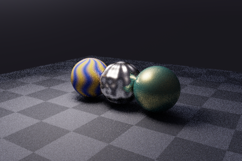
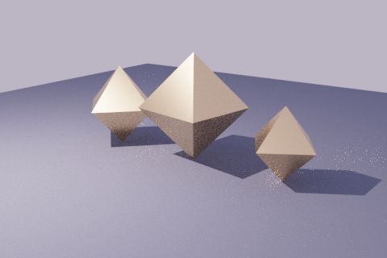
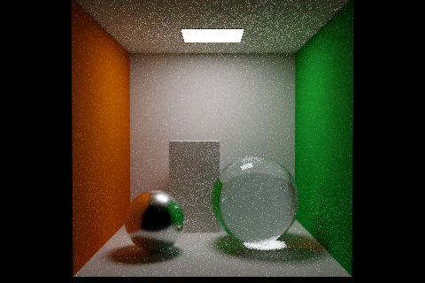
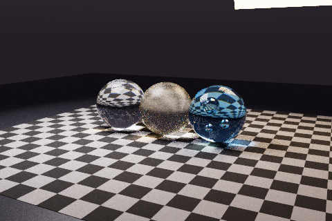
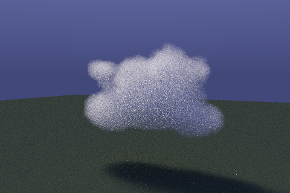

# CYBR LIGHT

**Offline spectral rendering with a native C++ engine and a Python scene API.**

An experimental [browser WebGPU transport lab](browser/README.md) now renders
the real Combat and Springs meshes with a resident BVH, GGX/light MIS and temporal
reconstruction. It is an RGB backend, not spectral parity; see its measured timings
and explicit quality limitations before using it in production.

CYBR LIGHT traces wavelength-dependent light through explicit geometry, materials, and participating media. Build scenes in Python or load scene files, render on the CPU, and save floating-point films, diagnostic buffers, and display previews. The toolkit also includes material-shader compilation, image derivatives for selected material controls, and low-dimensional inverse-rendering workflows.

## Gallery

| Anisotropic metals | Spectral caustics |
| --- | --- |
|  |  |

| Textures and material mixtures | Scene loading and instancing |
| --- | --- |
|  |  |

| Indirect illumination | Nested glass |
| --- | --- |
|  |  |



Previews use a display transform without denoising. [Render records](docs/media/index.json) include settings, timings, and image hashes. The cloud example uses a procedural density field.

## Features

- **Spectral light transport:** wavelength sampling, multiple importance sampling, Cauchy dispersion, and Beer-Lambert absorption; path, volume-path, direct-lighting, ambient-occlusion, and surface photon-mapping integrators.
- **Geometry and materials:** a surface-area-heuristic BVH, analytic spheres/quads/disks/cylinder sides, smooth triangle meshes, OBJ/PLY import, diffuse and glossy surfaces, anisotropic GGX metals, smooth/rough glass, textures, normal/bump maps, and material mixtures.
- **Media and optics:** homogeneous and bounded heterogeneous volumes, isotropic/Henyey-Greenstein/Rayleigh scattering, Stokes/Mueller polarization models, and nested dielectric boundaries.
- **Cameras and output:** perspective, orthographic, spherical, and thin-lens cameras; shutter sampling for translating geometry; reconstruction filters; PFM, float32 EXR, PNG, diagnostic buffers, and checkpoint/resume.
- **Python workflows:** scene builders, a checked XML/dictionary loader, named references, transforms, parameter traversal, portable asset bundles, native material-shader compilation, and parameter fitting.

See the [capability matrix](docs/CAPABILITY_MATRIX.md) for supported combinations and implementation limits.

## Requirements

The native build is tested on Linux. Use WSL for the same build workflow on Windows. Native Windows and macOS builds are not covered by the current CI.

| Component | Requirement |
| --- | --- |
| C++ compiler | C++17 support; the supplied build uses GCC/Clang-style flags |
| CMake | 3.16 or later |
| Python | 3.10 or later |
| Python packages | NumPy and Pillow, installed by the command below |
| Parallel rendering | OpenMP, when available |

A GPU is not required. The default package does not install the optional tensor or portable-compute backends.

An opt-in [native CUDA/OptiX spectral surface backend](docs/OPTIX.md) is now
available as a separate executable. It has physical RTX 4060 validation for
the supported surface subset, including the instrument's coated glass, water,
and measured metals. It is distinct from the experimental Numba backend and
does not silently substitute CPU rendering for unsupported scenes.

## Quick start

```bash
git clone https://github.com/cybrdelic/cybr-light.git
cd cybr-light

python -m venv .venv
source .venv/bin/activate
python -m pip install -e .

cmake -S . -B build -DCMAKE_BUILD_TYPE=Release
cmake --build build --parallel 4

# Render a small end-to-end example.
python tools/examples.py anisotropy --preset smoke

# Render a larger glass preview.
python tools/examples.py dielectrics --preset preview
```

Open `rendered/examples/anisotropy.png` or `rendered/examples/dielectrics.png`. Cloning a private repository requires an account with access.

For an executable installed elsewhere, set `CYBR_LIGHT_BINARY` to its path or pass `--executable /path/to/cybr-light` to the rendering CLI.

## Examples

```bash
# List recipes without rendering.
python tools/examples.py --list

# Render selected scenes or the complete set.
python tools/examples.py cornell materials --preset preview --threads 4
python tools/examples.py all --preset smoke

# Increase the offline sample budget and choose an output directory.
python tools/examples.py dielectrics --preset reference \
  --width 1280 --height 720 --spp 256 --threads 4 --out rendered/glass
```

| Recipe | Demonstration |
| --- | --- |
| `anisotropy` | Analytic cylinders and anisotropic metal highlights |
| `caustics` | Camera-view spectral photon mapping |
| `rayleigh` | Polarized Rayleigh multiple scattering |
| `transparent` | Tinted sheets and transparent shadows |
| `materials` | Textures, normal maps, and material mixtures |
| `shader` | Compiled spectral material and image derivatives |
| `xml` | XML references, PLY geometry, and transformed instances |
| `studio` | Spectral material studio |
| `cornell` | Indirect illumination and diffuse color bleeding |
| `dielectrics` | Rough/smooth glass, absorption, and air inclusions |
| `mesh` | Procedural knot exported and imported through OBJ |
| `fog` | Homogeneous participating media and light shafts |
| `cloud` | Heterogeneous density tracking and multiple scattering |
| `polarization` | Aligned, rotated, and crossed polarizers |
| `dof` | Thin-lens depth of field |
| `motion` | Shutter-time sampling of translating geometry |

### Quality presets

| Preset | Resolution | Sample packets per pixel | Wavelengths per packet | Caustic photons |
| --- | --- | --- | --- | --- |
| `smoke` | 160 x 106 | 4 | 4 | 20,000 |
| `preview` | 480 x 320 | 64 | 8 | 500,000 |
| `reference` | 720 x 480 | 192 | 12 | 2,400,000 |

`--spp` counts wavelength packets, not individual spectral paths. The `caustics` recipe caps camera packets at 24; its photon budget is set by the preset. The `reference` preset increases sampling work but does not guarantee convergence. `--width`, `--height`, `--spp`, and `--threads` override their respective defaults.

Outputs go to `rendered/examples/` unless `--out` is supplied. Use `--previews-only` to retain only PNGs and compact records, or `--export-only` to write scene bundles without rendering. [Additional example workflows](examples/README.md) cover inverse fitting, material compilation, and the forward photon detector.

## Python scene API

Save this as `render_scene.py` and run it with `python render_scene.py` after building the engine:

```python
from cybrlight import Camera, Scene, Settings, render

scene = Scene("Spectral glass")
scene.settings = Settings(
    width=640, height=424, spp=96, bands=12, threads=4,
    film_format="openexr",
)
scene.camera = Camera(origin=(4, 2.5, 6), target=(0, 0.7, 0), fov=38)

floor = scene.material(type="diffuse", color=0.6)
glass = scene.material(
    type="glass", ior_a=1.5, ior_b=0.008,
    absorption=(0.25, 0.04, 0.01),
)
scene.quad((-5, 0, -5), (0, 0, 10), (10, 0, 0), floor)
scene.sphere((0, 0.8, 0), 0.8, glass)
scene.point_light((-2, 4, 3), 45)
scene.environment.update(color=[0.5, 0.65, 0.85], strength=0.15, flat=True)

render(scene, "rendered/custom/glass")
```

Three-component material values are spectral authoring controls, not calibrated sRGB reflectance measurements. See [spectral data notes](data/README.md) and the [scene API implementation](python/cybrlight/__init__.py) for available parameters.

## Scene files and bundles

The Python CLI loads the supported XML/dictionary syntax and snapshots. Native `.cys` files can be passed directly to the renderer. Unknown scene directives and unsupported parameter combinations are rejected.

```bash
python -m cybrlight validate examples/workflow/instances.xml
python -m cybrlight render examples/workflow/instances.xml \
  --out rendered/xml --spp 64 --size 640 424 --threads 4

# Inspect available features and scene plugin names.
python -m cybrlight features
python -m cybrlight plugins

# Export an asset bundle and rebuild its native material shader.
python tools/examples.py shader --export-only --out rendered/bundles
python -m cybrlight rebuild-shaders rendered/bundles/shader
python -m cybrlight render rendered/bundles/shader/scene.cys --out rendered/shader
```

Native shader libraries execute code. Only load libraries or rebuild shader sources from trusted scene bundles.

### Resume an offline render

```bash
python -m cybrlight render examples/workflow/instances.xml \
  --out rendered/resumable --spp 32 --checkpoint rendered/resumable.chk

python -m cybrlight render examples/workflow/instances.xml \
  --out rendered/resumable --spp 128 --resume rendered/resumable.chk \
  --checkpoint rendered/resumable.chk
```

On resume, `--spp` is the target total packet count. Checkpoints validate scene and asset signatures; keep scene, camera, and sampling settings compatible. Checkpoints are specific to the native build/format rather than a universal interchange format.

## Output files

The native workflow writes linear PFM films and PNG display previews. Set `film_format="openexr"` to write float32 EXR as well; the example runner enables EXR by default. Auxiliary files contain diagnostic passes, scene inputs, and render records. Gradient and Stokes buffers depend on the selected rendering mode.

Use the floating-point films for numerical comparisons. PNGs are tone-mapped and gamut-clipped for display. Diagnostic geometry passes use a center sample rather than matching filtered, depth-of-field, or motion-blurred camera integration. The native EXR writer supports uncompressed, single-part scanline files.

## Tests

```bash
ctest --test-dir build --output-on-failure
python -m unittest discover -s tests -p 'test_*.py' -v
python tools/check_repository.py
```

[Native CI](https://github.com/cybrdelic/cybr-light/actions/workflows/native.yml) builds the C++ renderer, runs the C++ and Python suites, and renders smoke examples. Numerical tests, scene-import checks, gradient comparisons, and checkpoint tests cover specific behaviors; they do not establish correctness for every scene or optical model.

## Current scope

CYBR LIGHT is an experimental offline renderer. The camera-view photon mapper uses a biased surface-density estimate. General visibility-aware automatic differentiation, unbiased bidirectional transport, hardware ray-tracing acceleration, and arbitrary overlapping dielectric solids are not implemented. Native image derivatives cover selected material/shader controls; general parameter fitting uses finite differences. Cameras should start outside dielectric interiors.

The optional Numba CPU/CUDA transport and PyTorch tensor examples are separate from the native renderer. Physical GPU execution is not validated by CPU or CUDA-simulator tests. Volume and polarization combinations have additional restrictions listed in the [capability matrix](docs/CAPABILITY_MATRIX.md).

## Project layout

```text
include/cybr/       Geometry, materials, transport, optics, films, and acceleration
src/               Native renderer and forward photon-detector executables
python/cybrlight/   Scene API, file I/O, CLI, compiler, and inverse workflows
examples/          Procedural scene builders and XML/PLY fixtures
tools/examples.py  Example runner and bundle export
tests/             Native numerical tests and Python regression tests
docs/              Architecture, capability matrix, references, and provenance
docs/media/        Rendered previews and reproduction records
LICENSES/          Retained component license notices
```

[Architecture](docs/ARCHITECTURE.md) describes the renderer and shader interfaces. [Algorithm references](docs/REFERENCES.md) document the mathematical models and dependencies. Generated assets, raw films, and compiler caches are created locally rather than committed.

## Contributing

Keep changes focused and include a regression test or a small reproducible scene. For rendering issues, include the scene, command, platform/compiler, render record, and an unfiltered film when practical. Run the test suites and relevant smoke examples before opening a pull request.

## License

See the repository's [GPLv2 license](LICENSE) and the retained [original engine MIT notice](LICENSES/CYBR_LIGHT_ORIGINAL_MIT.txt). Optional dependencies retain their own licenses. [Source provenance](docs/NATIVE_PROVENANCE.json) records original file digests and documented source edits.
