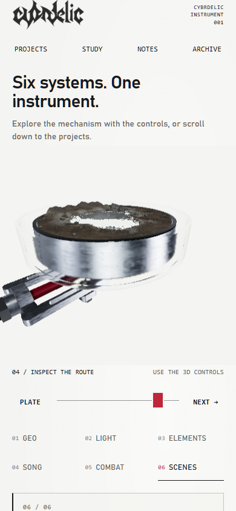
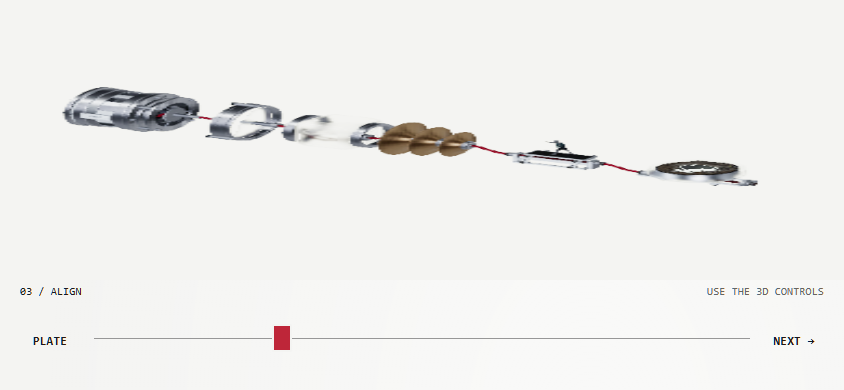

# Mobile layout and progressive native geometry

The source-publication baseline is commit
`d9cd9874d411d194b1b2a82ea6aaf97b9c3c8f7f`. Original laptop files and the
original geometry package remain preserved. This update addresses the requested
mobile scrolling, navigation and startup problems.

At widths up to 900 px, the homepage uses normal page flow, a stable canvas and
controls at least 44 px high. Scrolling does not change the instrument pose.
The six existing chapter controls and project links remain usable during loading.
GEO opens in 3D immediately after its complete native component is ready; other
chapters open their existing project details until the full instrument is ready.
The starter's slider and horizontal drag rotate GEO; vertical gestures scroll the
page. The completed instrument restores its original arrangement slider, all six
inspection stops, Plate and the original full meshes and finishes. It opens at
the assembled pose (`0.28`) on mobile. Desktop keeps its existing scroll tour.

Mobile first transfers the complete six-mesh GEO component: **1,288,028 bytes**,
restoring **6,987,616 bytes**. Its decoded SHA-256 is
`0f058ab81c583fc70e7afccbf68f19002c0301a101af0715a6ea0c4e4585f335`.
It uses the original positions, normals, indices, UVs, occlusion and finish data,
the original photographed HDR and machined roughness, with an interactive camera.
This is a real native model, not a static image or simplified mesh. The starter
uses the existing procedural material finish while the final material maps load.
The full instrument follows in the background using the same renderer; starter
resources are released before the original complete scene is constructed.

The original full gzip is **44,827,908 bytes**, expanding to **96,899,824 bytes**.
The additional full transfer is **34,808,214 bytes**, 22.35% smaller. Both new
packages use reversible XOR prediction and byte-plane ordering before gzip.
A dedicated worker restores and hashes the native bytes. The full decoded hash
remains `486afb1b0c1ea6bb75642626beb6fb4b284db9824d99bdbb21de7ee7456fc756`.
All 56 mesh records and all final textures, material groups, shadow resolution,
transmission settings and reflection resolution remain retained. Progress shows
actual transferred bytes and separate first-usable/full-ready timestamps.

On mobile, reflection refinement waits for a settled pose and captures bounded pieces of
the original six 128 px cube faces, then convolves the complete cube.
Navigation discards partial captures. Each face restores all live renderer,
material, light and scene state. Refinement presents the existing full-resolution
HDR image when no visible scene state changed. Transmission read passes are
skipped only when conservative native bounds prove every optical mesh is outside
the camera. Offscreen ELEMENTS pauses its shared fire/water playback clock while
retaining the last radiance and bounded direct light. Resolution and authored
visible rendering settings are unchanged.

Reproduce both transfer files from the retained original without rendering:

```powershell
python -m pip install -r tools/requirements-native-smoke.txt
python tools/pack_geometry.py
python tools/tasks.py test
```

The original package remains available for older variants and
`?transfer=legacy`. Use `?startup=full` to bypass the progressive stage for an
explicit comparison. Browsers without Worker/SubtleCrypto use the original
complete startup. Serve `.gz` as a gzip file **without** HTTP
`Content-Encoding: gzip`; the loader decompresses it itself.

CPU regression validation passes, including exact full/GEO byte identity,
construction and disposal of all six GEO meshes, partial-capture cancellation,
per-face state restoration, conservative bounds and retained HDR presentation.
The prior full-transfer-only candidate failed the matched browser comparison:
layout improved, but first readiness did not improve and a LIGHT tap timed out.
The final runtime completed the native Intel mobile-viewport checks recorded
below. Its current cold-network acceptance remains unverified. The historical
10 Mbps / 80 ms / CPU x4 comparison is a partial failed earlier candidate,
not a current performance claim. SwiftShader emulation does not establish physical
Android GPU performance; physical-device and optional WebGPU coverage remain open.


## Post-load responsiveness follow-up

The matched SwiftShader comparison of `62083f3` observed complete GEO at 9.43 s
from navigation (captured at 9.61 s), compared with 78.58 s for the baseline's
first complete instrument. Early navigation actions took 57–295 ms. Full-scene
acceptance failed: a 24.44 s main-thread task followed full readiness, and the
existing canvas lookup/scroll timed out after 5 s. This was an unresponsive page,
not a missing canvas. Full-model ready timestamps were 64.37 s / 65.96 s, so
total full readiness was not improved. Those partial receipts remain preserved.

The follow-up keeps mobile GPU timing opt-in (`?timing=gpu`), retaining CPU
metrics without disjoint/query polling. The long task occurred outside the
measured draw submission and closely matched the 22.75 s startup GPU duration.
That correlation alone does not identify the driver, compositor or another
process as the cause. The later focused run below separates handler execution
from browser visual feedback; the later trace below identifies a software readback interval. The measurement harness now uses cached adapter
metadata instead of making its own WebGL queries.

Reflection work now yields between at most 8,192 original triangles per
submission, in the vendored renderer's original opaque order. All six 128 px
faces, original background conversion, depth state and complete-cube convolution
remain retained. Background conversion also yields by native face. Capture
shader variants warm asynchronously before use; live state is restored before
awaiting. Navigation cancels partial geometry pieces and deferred work. A camera
or viewport change reuses the original 2048 px shadow map only when every tracked
world matrix, geometry/attribute identity, buffer version and visibility flag is
unchanged. Actual geometry changes invalidate it.

315 CPU regressions pass after the backpressure follow-up below. Native browser acceptance of that runtime is recorded below; the earlier
software and harness failures remain preserved.
The focused full-loaded chapter/landscape check retains the 5 s responsiveness
timeout and requires chapter tap actions below 1 s. It omits the repeated cold
baseline. A separate cold candidate check retains 10 Mbps aggregate / 80 ms /
CPU x4 conditions. The original baseline assertion tolerance is transparently
corrected to 0.001 to allow scroll pixel rounding (0.490044 vs 0.49). Previous
failure evidence is not overwritten. SwiftShader does not establish physical
Android GPU performance.

## Bounded mobile rendering candidate

The focused check of `fd4278d` completed and released its owned browser/server
in 53.91 s. Reflection slices took at most 16.4 ms of CPU submission time,
and mobile GPU timing queries were disabled. The 5 s canvas check and GEO tap
passed, but LIGHT took 4.81 s, ELEMENTS 9.74 s and SONG timed out at 10 s.
All-chapter and landscape acceptance therefore failed; this candidate was not
pushed or deployed.

Recorded click handlers took 1.6-2.2 ms, with 11.5-48.2 ms from event timestamp
to processing. Browser EventTiming reported 2.45-3.60 s from input to paint.
Playwright's action span also includes waiting before the browser issues input.
The later checks record pre-event wait, handler timing, actual browser
input-to-paint and selected geometry completion separately. A missing duration
inside JavaScript measurements is not proof of compositor causality.

The new mobile gate allows one outstanding WebGL frame, using zero-timeout
fence checks and coalescing subsequent requests to the latest target. It holds
submission and polling through a pointer gesture and for 120 ms afterward,
so chapter selection can paint immediate accessible feedback. Hidden canvases,
hidden documents and open project details pause waits and playback. Reflection
captures retain coherent partial work while paused; a new pose invalidates it
before resuming. Completed static frames do not request another render. Existing
reduced-motion behavior still stops the shared fire/water playback clock.

The gate retains the native final geometry, materials, buffers, optical settings
and shadow/reflection resolutions. It does not cancel commands already submitted
to WebGL. GPU fences establish when a selected pose has finished rendering;
they do not establish when the browser composites that image. Startup records
CPU setup and first GPU completion separately. Completion-wait duration includes
intentional interaction pauses and is not a hardware GPU duration measurement.
`?frame-gate=off` is available for a controlled comparison. Desktop and optional
path-tracing routes keep their previous scheduling.

CPU tests cover one-frame ownership, zero-timeout checks, coalescing, interaction
holds, visibility/modal pauses, idle frames, context failure and owned-resource
disposal. Probe tests check retained partial captures and invalidation on resume.
The native checks below required all six selected poses to complete, kept
the 5 s canvas check and sub-second tap criterion, and checked landscape
and reduced-motion playback. Exact final pixel equivalence is not certified.

## Recorded native acceptance

The tested runtime is `d9b73508b4c0282e6d8620a09f25ccbb1ef1eb08` on top of
the publication baseline above. Documentation-only successors retain these
results. Chrome 154 used Intel UHD Graphics / ANGLE D3D11, a 390 x 844 touch
viewport, DPR 1, main-target CPU x4, disabled caches and 80 ms request latency.
Local transfer was unthrottled. This is desktop hardware emulating a viewport,
not a physical Android result; dedicated-worker throttling is not established.

The preserved native baseline passed six chapters with tap actions of 58-398 ms
and showed its complete instrument at 18.08 s from navigation. The candidate
showed complete native GEO at 2.45 s and its full instrument at 20.14 s. First
usable geometry improved in this local setup; total full-model readiness did
not. App-relative markers were 1.40 s / 19.08 s and use a different origin.
Peak aggregate browser RSS was 2.93 GB baseline / 3.14 GB candidate; shared
pages may be double-counted. This remains a heavy complete scene.

All six candidate chapter poses completed on the GPU, with tap actions of
37-207 ms. The visible shared fire/water clock advanced. The final SCENES
reflection completed all six original 128 px faces, with matching captured
and geometry epochs and blend 0.15. It took 67.08 s to settle; its maximum
timed refinement step was 6.46 s. This native performance limitation remains
documented. Original full geometry bytes, meshes, finishes, optics and shadow
and reflection resolutions remain retained; visual evidence does not establish
exact pixel parity or photographic transport.

A narrow follow-up completed on the same Intel adapter. Direct trusted native
touch scrolled ordinary content 199 px and the 3D area 206 px while retaining
the selected pose. Hit testing found the ordinary paragraph and the underlying
main element, respectively, with `touch-action:auto`; no gesture was prevented.
Landscape at 844 x 390 had no overflow. Visible playback stopped advancing
under reduced motion. Early/fully-loaded Close actions took 426 ms / 341 ms.
An earlier early Close took 1.11 s: 628 ms before event issuance, 416 ms queued
before processing and 1.6 ms in the handler, all during startup mesh setup.
That transient queueing observation is retained rather than generalized to
ongoing controls. No uncaught page JavaScript error occurred in these checks.

The CDP synthesized-scroll diagnostic failed in both ordinary and 3D areas.
It logged touch-start/end without touch-move events and moved neither page.
The separate trusted touch-start/move/end sequence scrolled both. The failed
protocol diagnostic remains a harness limitation; it is not evidence of an
application scroll trap. The previous handoff assertion also failed because
the temporary diagnostic object is absent during full mesh construction;
DOM/navigation continuity and established full readiness passed afterward.

The SwiftShader run retained slow pre-event waits (up to 8.34 s), despite
1-5.2 ms click handlers and 16-56 ms browser click-to-paint. Its trace recorded
a 4.97 s `GLES2::ReadPixels`/`WaitForCmd` interval inside
`LayerTreeHost::DoUpdateLayers`. That locates a software readback wait in this
run; it does not establish physical-device compositor performance or dismiss
the separate native refinement cost.





Both images are unedited browser captures of the existing model. Receipt hashes,
the exact runtime and recovered snapshot provenance are retained in
[native acceptance metadata](NATIVE_ACCEPTANCE.json). GPU/browser resources
were closed between coordinated checks. Publication and deployment are separate
from the validation results; physical-device and cold-network coverage remain open.
